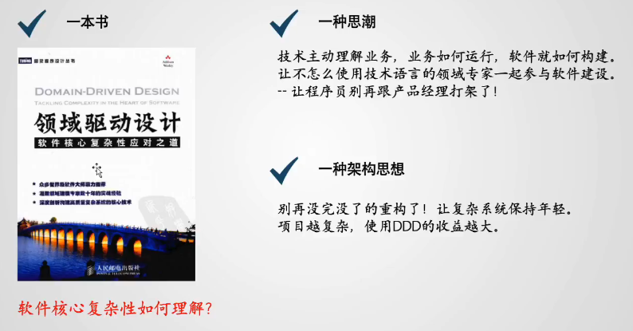
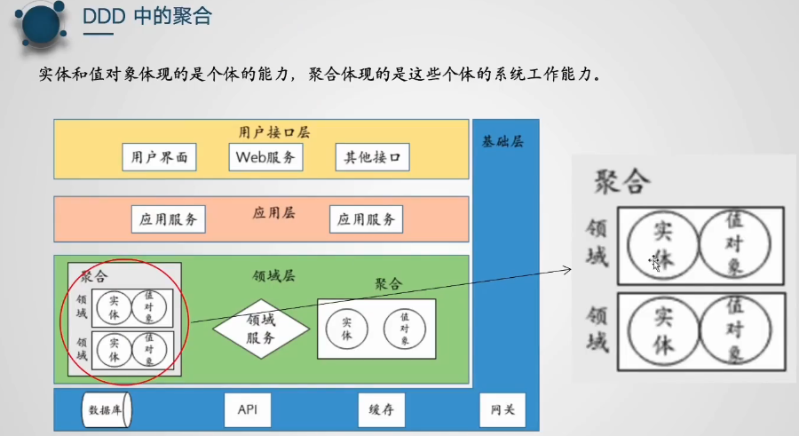

# 1、入门

看完本学习笔记，你可以掌握的东西：

- 为什么要用DDD，大家都说DDD好，所有大厂都在用，那DDD到底好在那里，相对MVC三层架构的优点又是什么？他的缺点在哪里？
- 了解DDD中每个概念的由来，以及他每个设计的巧妙之处；
- 具体落地到代码的研发规范。


## 1.DDD软件核心复杂性应对之道

**DDD技术画像**



DDD诞生于这样一本书，当然国内也有更新的一些版本，但基本都包含了这两个标题的内容，主标题：领域驱动设计，子标题：软件核心复杂性应对之道。个人觉得这个副标题更能够体现DDD的一个作用，因为直接谈到这个领域驱动，可能很难说清楚领域这是什么东西，比较抽象，但是从副标题我们可以看出，DDD所要面对的问题是：软件的核心复杂性，而不是像SpringBoot框架那样帮我们搭建一个Web开发的应用，他并不是一个快速开发的框架。

**那什么是软件的核心复杂性呢？**

其实复杂性这个东西呢我们比较好理解，做软件我们就是要不断的面对一些复杂性的问题，然后去克服这些问题，这都是复杂性的表现，例如说我要使用缓存，那具体要如何使用，要注意缓存穿透、缓存击穿等这些问题，对吧，这都是一些复杂性问题，又比如说我要做一个权限体系，那我可能必须要了解需oauth 2.0，那如果你不了解oauth 2.0，那么这个协议就是你软件开发的一个复杂性。但是这种复杂性，和DDD说面临的核心复杂性有什么区别呢？我们可以简单的先理解一点：像oauth 2.0，像redis缓存这样的技术，他的确是一个复杂性，但是他不会永久耽误你开发的工作，如果我oauth 2.0不会、redis不会，我去学一学就行了。这些复杂性都很容易去解决，而DDD所要面临的是什么呢？是软件在研发、生成的过程中，一直要面临的一种共性的复杂性，这种复杂性往往没有一个很好的框架来帮你去很好的解决。


补充一点DDD的历史：DDD整个理论体现是在04年左右提出的，但是整个DDD理论体系火起来是在15年往后，15年微服务整个体系出来之后，他才火起来，重新进入到大家的视野。那么从整个简单的历史，可以看出来一点，DDD它本身就是一个很经典的理论体系，它并没有预言到后续这些微服务的架构思想，但是它依然可以带给我们很大的帮助，依然到现在还有很多互联网公司在推崇DDD——这个20年前的东西，就说明DDD他要解决的问题并不是某一个阶段的问题，而是整个软件研发过程中所面临的共性问题，所以说我们在学习DDD的时候，应该和学习Spring、学习微服务这些框架有一些区别，我们要学会以一种动态的视角来看待我们的技术，要学会把我们自己的技术体系放在整个历史的长河当中来衡量，包括我们现在学的技术，还要考虑以后我们怎么去变迁。这就是一个软件核心复杂性的主题，从变化的角度来看技术，从发展的眼光来看技术。


**DDD的两个技术画像**

此外，DDD还有两个技术画像，个人认为是对他整个定义比较有特征的一个东西；

1. **DDD他是一种思潮：让技术主动理解业务，业务如何运行，软件就如何构建。**

   其实，现在我们说技术本身是并没有太多的价值的，技术这个东西本身是不会带来价值的，只有你技术和业务结合，解决了业务当中的问题，你的技术才能体现出来价值。所以我们在研发中往往都希望技术和业务能够贴合的，这样软件才能体现出更大的价值。

   还有就是：让程序员别再和产品经理打架了。这里有一个故事，产品经理提了一个很神的需求，要求用户APP的主题颜色能根据手机壳自动调整。程序员直接崩溃了，导致了和产品经理打架了，既然我改造不了app，那我改造一下你好了。

   

   其实这个问题核心在于我们的需求在技术和产品之间，在不同人的视角下，他是不统一的。所以说DDD也是一种思潮，让业务和技术能够互相理解，在这种思潮的影响下，推动了DDD的落地。

2. **DDD具体落地的形式是一种架构的思想：就是要减少系统的重构，让系统永远保持年轻，**这个重构来说对于架构来说是一场灾难，我前期做了很好，很精妙的设计，然后在项目研发过程中，因为 一些问题导致我不得不进行一轮又一轮的重构，而重构这个事情在业务上是没有任何价值的，所以很多架构师都希望我的项目能够往后不断的进行演进，但又不需要进行重构，通过做加法的形式来让系统更加的完善，更加的强大。所以也推动了大家对于DDD整个思想的迫切需求，目前几乎所有大厂都在使用，实践，非常火。


## 2.MVC vs DDD

**那他到底火在什么地方呢？到底好在哪里。接下来我们对比MVC和DDD的区别。**

**其实对于DDD呢，最简单的一个目的是什么？就是要做系统的拆分。**


**MVC下拆分不灵活：**MVC架构下，我们在实现功能的时候，都是上层做一些业务接口，下层再进行服务的调用，下层是非常混乱的。这就会导致一个问题：就是如果我的项目就只是做成这个样子那也就还好，代码堆在一起就堆在一起了，但是当我项目越做越大时，那么你就一定会想到一个事情——要对功能进行拆分，但是拆分这个事情，在我们微服务的思想下，在我们MVC架构的思想下，前期设计很容易，例如要把商品管理和支付管理拆分，我直接建立不同模块就好了，但是到了中间的时候，你想要拆分基本上是拆不动的。比如这个图，你想要把A、B两个功能进行拆分，怎么拆，存在大量混乱的相互调用，根本拆不动。这也就造成了一个问题，我们的项目通常在启动前期都是设计的非常好的，但是当我的项目在演进的过程中，如果还要拆，那就完蛋了，根本拆不动，比如说商品，前期我们可能做一个微服务就够了，但做着做着就会有很多稀奇古怪的需求出来，以淘宝为例，在淘宝上购买的商品明显就分为两个大的类别，一个是实体商品，送货到家的，还有一个是虚拟商品，比如会员卡，游戏币等；而这两种的购物流程是有很大的不同的，那在开发的过程中，想要进行拆分就几乎是不可能了，这也就是造成了架构不灵活的问题。


DDD改善了这种情况，将整个应用看成是领域和领域之间的组合，以搭积木的方式来构成这样一个组合，从前期设计的时候就将项目看成是领域的一个组合，只不过组合形式的不同就组成了我们整个架构。在单体架构下，他可能就是领域在这种单体架构下一个组合，然后当我发现某一个领域的业务变得过于复杂的时候，或者说他的压力过大的时候就会将他单独拆分出一个微服务，比如说商品领域，这样就使得项目的建设过程变得更加的灵活，可以随时将领域在不同的结构之间进行整合，项目的设计也变得更加的合理。因为所有的设计都是根据我的这个运行过程来推进的，而不只是初期做的决定。所以DDD带来了整个架构上的一个颠覆。


那有人就有疑问：是不是可以把MVC架构随时替换成DDD架构呢？答案是很难，因为你要形参这种领域之间的组合 ，那你对整个架构的实现形式，包括具体功能的实现都是有很大的变化的，之间有很多很多问题要处理。


## 3.DDD的四大核心特点

### 3.1 以领域划分为设计基础

在进行实战之前呢，我们先要了解DDD的几个概念，特点：

1. **DDD是以领域划分为设计基础的。**从名字就可以看出，领域驱动。

   

   **那到底什么是领域呢？**

   这个问题其实非常的抽象，可以说并没有一个很标准的答案。在日常生活中呢，大家对领域也会有各自各样不同的说法，我们平常会说Java是领域，软件设计也是一种领域，那到底什么是领域呢？其实我们可以换一个角度来看，**领域的另外一个理解就是边界，领域也可以近似等价于边界**，当我们能把两个事情划分出一个明显的边界，我们就可以划分出不同的领域。比如说，我们说Java是一个领域，其实是为了将我们学习的java技术和python，C++等其他的语言进行一个区分，所以我们说每一种语言都是一个领域。同时，我们会说软件也是一个领域，是为了将我们的软件、硬件以及一些别的东西区分开，所以我们也会从这个角度划分一些领域。可以看出，**领域的核心就是边界**。

   那说到边界这个事情，其实所有技术人在在做项目的过程中都在接触边界、在划分边界，我们会很自然的在controller层划分出一些边界，例如我们经常写的UserController——负责用户管理的功能，OrderController——负责订单管理的功能。其实我们这里就划分了两个Controller，这两个Controller之间就有一个很明显的逻辑边界，而有了边界其实我们就可以划分领域。

   

   有人就又会问了：我随便写两个Controller这就叫划分领域了？就是在做DDD呢？怕不是在逗我把？

   **虽然我们在传统的这种MVC模式的开发下，经常会在Controller层划分这样的领域，但是他和DDD的领域有着本质的区别！**

   - DDD的领域强调的是从设计到落地，再到后面的开发过程中，一直持续的贯彻着这个领域；

   
   - 而我们在MVC架构下开发的过程中，是不会一直贯彻着这样的领域的，比如说我在用户管理层接收到这样的一个请求，那我们后端会写一个UserService对吧，负责用户这方面的业务处理，但是我们在订单领域中也是经常需要知道用户的一些信息，比如说我在下单的时候，要知道用户的账号，用户的收获地址手机号码等等，那如何去获取用户的信息呢？大概率就是直接在OrderController里面引入我们的UserService对吧。那么一个UserService相当于在两个Controller里面都用到了，在service层就打破了领域的隔阂，可以看出，虽然说mvc下领域有这种初始的划分，在开发的过程中往往是没有去坚守的，所以我们这种划分虽然有逻辑边界，但不能被称之为领域。
   
   
   
   好了，同学又有问题了，那既然是领域，那我就分两个service呗，再加一个OrderService呢。但其实也不是，不管你的类如何去拆分，我的订单领域始终是需要用户信息的，因为本质上是因为领域和领域之间是需要合作的，那怎么办？我又需要拆分出边界，边界之间又需要联系。其实可以看出领域这个事情，真正落地其实是一个很复杂的事情。既需要在逻辑上能够划分出明确的个体，有需要在业务上将他们整合为一个整体，他们之间既需要独立又需要合作。
   
   要实现从各个层面去划分清楚他们的边界，这个中间是有很多细节问题要去处理的，并且这种细节问题不太可能说按照某一个架构师的想法或某一个产品设计经验来解决，DDD想要将他做成一个普适性的一种方法，就是任何项目上都是通用的方法来解决这种看似矛盾的这种问题，这也是DDD的一个核心价值所在。
   
   DDD到底是怎样划分领域的，领域到底又是什么样的一个东西，具体落地下来又是什么，是一个Service嘛？或者说是一个类嘛？或者说是一个包嘛？是一个模块嘛？这就是后面需要了解的问题。其实对领域的了解有多深也就决定了你对DDD的了解有多深，同时也就决定了你对架构这个事情了解有多深。
   
   

### 业务优先vs技术优先

DDD强调的是以业务来理解技术，如何理解哈。

如下是按照DDD思想项目的两种包结构，可以看出很明显的区别：


比如左边这个，划分的这些东西application包啊，有domian这种，就是DDD四层架构里面的东西，应用层、领域层。

右边这个呢，直接就是划分各个业务领域，genservice、hisrequest等，代表应用上不同的功能模块，在这个模块下有一些相同的结构。

很明显的区别：右边就是业务优先，就是按照你的业务组合来划分了三个业务模块，一看我就知道sysManage是负责系统管理的一些业务，并且不同的业务模块具有相同的业务结构，那就意味着只要你搞懂了一个业务，对于其他的业务也可以差不多类似的摸索一下。而对于左边这个结构，你去了解的时候，如果你不去了解细节，是看不懂的，看起来是有相同的结构，但是每个业务下这么多service又是干什么的，是看不懂的。

所以体现出来的区别是什么？左边的这种实际上就是在DDD设计下以我们传统的MVC的思想来开发的，以前如果我们说别人不了解MVC，那大概率看不懂说controller包是干嘛的，service包是干嘛的，那现在即使换成了DDD，换成这种四层架构，换成领域层、应用层这些概念，但其实还是看不懂的，不看代码还是不知道这些部分是干嘛的。而右边这种我不看细节，我也能知道这些包大概是干嘛的，一个包就是一个业务功能。

总的来说就是两种视角，而业务优先能带来的最大好处在于我们不太懂技术的领域专家或者说业务人员，在一定程度上可以参与到这个建设过程当中，他知道我的项目有几个模块，那我自然就知道我的模块之间可以怎样去组合，而右边这个呢大概率是参与不进来的，都看不懂java代码，根本不知道这是干嘛的，划分这些实体是干嘛的，根本就不清楚。


### 3.2 DDD以通用语言为建设核心

这个在DDD中不断的被强调，那通用语言是什么？就是说让我的技术人员和我的业务人员，包括其他测试人员都可以用相同的频道来说话，大家不至于这种鸡同鸭讲对吧。DDD强调在每一个项目内要形成一个通用的语言。这种通用语言有很多种表达的形式，比如对我们程序员来说，每个领域上有相同的包结构，就可以理解为某种形式上的通用语言，是在我整个项目中通用的一种表达方式。


### 3.3 DDD以一系列抽象概念为开发模式

大家一接触到DDD，马上就会关注到ddd带来的这一系列抽象的概念，比如说值对象啊，实体，领域服务等，有些东西还是比较好理解，比如实体，但有些概念就显得有点莫名其妙了，比如防腐层、聚合、限界上下文，可能跟我们平常开发过程很不一样，这造成很多人一上来其实他就去注重这些概念。但其实我们了解DDD更重要的是什么呢，它的每一个所谓的这些抽象的概念背后其实都是对一种开发模式的沉淀与总结，所以我们去了解每个概念的时候，首先是要了解它是干嘛的，但其实更重要的是要了解他是怎么来的，只有了解他们怎么来的，你才可以了解DDD一整套思想到底解决了一些怎样的问题，以及他是如何去思考这些问题的。


### 3.4 DDD以四层架构为基本思想

四层架构是DDD构成领域的一个基础。


通过将这两种架构进行对比，就能够以我们已有的这种开发作为经验来去了解DDD和我们的这种日常开发工作有什么不一样，可以给我们带来一些什么样的好处，以及他有什么样的一些缺点。


### 3.5 DDD有助于解决系统老化的问题


其实系统老化就跟我们人生一样，人生是从一个小孩慢慢的成长为青年然后慢慢变老，那我们老了之后会发生什么呢？思维变得越来越迟钝，然后往外闯的勇气越来越少。其实这种概念其实和项目开发是有一点类似，对于那些开发年限比较老的项目，一般都会有比较多的问题，而且这些问题并不是一下子就暴漏出来的，而是在软件开发过程中开始一点点暴露出来的。

1、沟通难。那我很多历史的需求我都不知道怎么回事儿，我要去找人去了解，需求人员换了一波又一波，根本就不理解这个以前的需求是怎么设计的。（也就是指代码看不懂，业务流程混乱）

2、开发难。有些代码一个类几百上千行代码，几乎没有可读性，特别是上千行代码的根本读不懂，改又不敢改，去掉了又不知道对其他的地方有什么影响。

3、对于一些快速开发的需求，我们根本无法考虑单元测试。

4、创新难。我们不断去学习新的框架新的技术，但是回到目前的老项目呢，又不敢动，比如说以前用的SSH框架（Struts + Spring + Hibernate），现在都是SSM一统江湖，那如果我要将一个老的项目换成SSM几乎是不可能的，Hibernate换成mybatis，几百上千的sql根本改不了，一个个改，想死的心都有。所以这就造成一个系统里面，初期设计很精妙，技术也很先进，但是慢慢的做了之后变得非常的老。

而DDD就能很好的解决以上问题。再次可以看出，DDD呢，并不是帮我们构建一个应用，而是在项目演进过程当中帮我们解决演进的问题，在项目初期他的作用可能不会那么大，所以学习DDD要学会以一种变化的眼光看问题。


## 4. DDD的小案例

其他课程讲DDD，都是一些架构师一上来就从非常熟悉的业务场景出发，从上而下讲设计，高大上，但是大概率听不懂。所以这里换一种讲解DDD的方式，用代码的方式带你自己理解DDD。

将MVC架构下实现的一个小支付功能转换为DDD思想架构下的实现，从中理解DDD的思想。

### 4.1 功能介绍


```java
public class PaymentController {
    private PayService payservice;

    public Result pay(string merchantAccount, BigDecimal amount) {
        Long userId = (Long) session.getAttribute("userId");
        return payService.pay(userId, merchantAccount, amount);
    }
}

public class PayserviceImpl implements Payservice {
    private AccountDao accountDao;// 操作数据库
    private KafkaTemplate<string, string> kafkaTemplate; // 操作kafka
    private RiskCheckService riskcheckService;// 风控微服务接口

    public Result pay(Long userId, string merchantAccount, BigDecimal amount) {
        // 1．从数据库读取数据
        AccountDo clientDo = accountDAo.selectByUserId(userId);
        AccountDO merchantDO = accountDAo.selectByAccountNumber(merchantAccount);
        //2．业务参数校验
        if (anount > (clientDo.getAvailable()) {
            throw new NoMoneyException();
        }
        //3．调用风控微服务
        Riskcode riskcode = riskcheckservice.checkPayment(. . . ); 
        //4. 检查交易合法性
        if ("0000" != riskcode.getCode())) {
            throw new InvalideoperException();
        }
        // 5．计算新值,并且更新字段
        BigDecimal newSource = clientDo.getAvailable().subtract(amount);
        BigDecimal newTarget = merchantDo.getAvailable().add(amount);
        clientDo.setAvailable(newsource);
        merchantDo.setAvailable(newTarget);
        // 6．更新到数据库
        accountDAo.update(clientDO);
        accountDAO.update(merchantDO);
        // 7．发送审计消息
        string message = sourceUserId + "," + targetAccountNumber + " ,"
                + targetAmount;
        kafkaTemplate.send ( TOPIC_AUDIT__LOG,message );
        return Result.SUCCESS;
    }
}
```

 这种方式的开发，写起来很快，需求完成的速度也很快，但是会带来很多问题，埋下了很多坑，会带来很多老化的一种风险。

**埋下的问题：**

**1、可维护性差：大量的第三方模块影响核心代码稳定性。**比如说他的调用方式变了啊，传参方式变了，返回结果变了。那么我们的核心代码就要跟着一起改，但是这些修改和我本身做的这个转账业务是没有任何关系的，就会造成可维护性差。


**2、可拓展性差：业务逻辑与数据存储相互依赖，无法复用。**

比如说，我已经形成转账这样的一个业务流程了，未来我也希望借鉴一个现有的转正流程，那么这种代码基本没有可参考性的，如果这段代码换到另外一个系统会出现什么情况，你的表结构可能不一样，你的第三方服务可能不一样，比如不用kafaka等，这段代码几乎没有可用性，体现不出一个内部逻辑，除了这几个12345的步骤可以简单参考，所以他的业务很难去扩展。比如说我未来要加一些缓存服务，是不是就要重新改这段代码，全部要改。

**3、可测试性差：庞大的事务脚本与基础设施强耦合，无法单元测试。**

如果我们要测试这样一个方法，所有的周边服务都必须要部署好，数据库，微服务，kafka都要有，你才可以测试。那比如说，我现在就想测一下我从数据库里面读出来的用户信息是否正确，这一小段，是没有办法测的，因为整个这是一个完整的代码啊，怎么只测试这一部分呢。


所以这样的代码的问题就是：初期你做起来快，并且也没有任何问题，但是当你的业务迭代几次之后，当你的转账业务出现任何的风吹草动，你就不断的改，不断的改，到最后这段代码就容易形成一个所谓的黑洞。所谓的上前行代码就是这样来的，比如说我要加一个新的流程到业务里面去，原始的代码根本不敢动，比如加一个redis缓存，那我就在中间加一个缓存代码，其他的上下代码都不敢动。那如果要加一个本地缓存，又搞一个代码，那么这段代码就不断的膨胀，不断的膨胀，最后前面说的老化问题就会一个个慢慢的浮现出来。


### 4.2 高质量应用

所以这些与其说是需求的问题，不如说是技术的问题，所以我们就需要一些方法来解决这样的问题，那如何解决？我们先抛开DDD不谈，至少有几个基础的原则我们是理解的：

**如何构建高质量应用：高内聚、低耦合**

即希望我的项目能够形成一些内敛的功能模块，通过功能模块这样的组合来形成整个的业务场景，那么对于每个部分的改动就可以放到某一个具体模块里面，就可以搭建一个高质量应用。这一般就是我们软件研发最终的一个目标，但这种目标怎么达成，具体如何实现其实很困难，很多时候每个研发人员可能都有自己的一套方法论，很难去统一。

目前业界抛开DDD，唯一比较有参考价值的是以下三个基础设计原则（方法论），也是大家形成共识的一些东西：

- 1、单一职责原则：一个类只负责单一职责，另一种理解也就是一个类应该只有一个引起他变化的原因

  比如说如果我上每个这个 Payservice类专门负责转账流程，那么我就希望只有我的转账业务流程发生变化了，我才需要去修改这些代码，其他情况下我这段代码都不需要动。

- 2、开放封闭原则：对扩展开放，对修改封闭

  未来如果有一些些风吹草动的时候，我希望能够以扩展的方式来增加新的功能，而不需要改我的原始的业务代码。

- 3、依赖反转原则：程序之间应该只依赖于抽象接口，而不要依赖于具体实现。

  这个很好理解，因为基于接口，我们可以很好的做扩展。这一点其实也有一些体现，比如说我们做业务开发，经常都是要求service这块做一个接口，然后我们自己写一个实现类。这种方式虽然形式上是面向了接口，但是这种扩展是毫无意义的，我们一般说做一层接口的目的是因为在接口下可以有多种不同的实现，我现在用这个实现的，未来可以用一个新的实现类，但是在我们当前的这个场景下，不管你的业务有多么的负责，转账的这个业务流程在我系统终只可能有一种实现啊，只可能有一个流程啊，难道还有其他流程吗，所以这种实现类它是没有扩展的可能性的。

  > PS：所以后面可以看到DDD中有些是要有service、serviceImpl两部分的，有些是只要有Service的。
  
  

所以从整个形式上来说，我们有三个比较好的设计原则来指导我们对这段代码进行一个优化，也是不管你通过什么样优化方法要达成的一个目标，来实现构建高内聚低耦合高质量应用，让代码在面对老化问题时，能够变得经抗一点。

### 4.3 DDD改造

那怎么去做呢？既然要改造就有各种各样的改造方法，下面就按照DDD的设计思想对这段代码进行改造。然后在这个过程当中，希望大家能够体会到DDD到底是好还是坏，任何事情肯定都有两面性，那DDD好的地方在哪里，坏的地方又在哪里。至于好大于坏，还是坏大于好，每个人都有自己不同的理解，也希望大家可以形成自己的衡量标准。

#### 第一步：抽象数据存储层

> **1、使用充血模型的实体对象，描述核心业务能力。**系统能做什么事情，一目了然。
>
> **2、使用仓库与工厂，封装实体持久化操作，摆脱数据库限制。**

我们可以看到数据库这一层任何一点风吹草动，都会影响到我的业务对吧，有的时候表结构发生一点点变化，都会影响到我的代码结构。

**首先DDD第一刀：对实体改造，使用充血模型的实体对象，描述核心业务能力**

就是对我们这个账户的实体类，进行改造，如下：

```java
public class Account {
    private Long id;
    private Long accountNumber;
    private BigDecimal available;

    public void withdraw(BigDecimal money) {
        //转入操作
        available = available + money;
    }

    public void deposit(BigDecimal money) {
        //转出操作
        if (available < money) {
            throws new InsufficientMoneyException();
        }
        available = available - money;
    }
}
```

通常来说，对于一个实体，我们的要求是什么？实体要有属性嘛，包括他对应的getter、setter，然后他不能带有业务逻辑，因为业务逻辑要交给上层的service去做，这也是大家常说的POJO类，或者说标准的JAVABean。

而DDD改造，可以看出除了这个实体的属性之外，他还把这两个转入、转出的操作也写进来了，这是什么情况呢？这就是跟我们传统的方式就不一样了，我们属性和方法业务会写在一起是什么操作，不是乱套了吗？但其实DDD对这个设计是有考量的，这种实体有一个很有意思的名字——**充血模型**；

**充血模型 ——》》贫血模型——》》Martin follow（microService）——》》贫血失忆症**

这就比较有意思了，其实充血模型这个概念是针对于另外一个概念提出的，那就是贫血模型，贫血模型其实就是一直我们在开发过程中使用的这种POJO的方式，只有属性和get、set，不包含业务逻辑。这个名词是由一个很有意思的人提出来的——Martin follow，如果说人名不知道的话，那说微服务大家肯定就知道了，微服务这个词就是他提出来的，这个哥们是一个很有意思的人，喜欢提各种各样有趣的概念，因为它本质上他就是属于一个技术专栏的一个记者，所以很会扯啊，天马行空的，但是他的这个理论功底你又不得不服气。那为什么说是贫血呢？贫血其实就是说这种代码有一个问题，他提出：**贫血模型很容易导致贫血失忆症！！！**又是一个新的奇怪的名词，贫血失忆症就是说：我们定义这些实体，实际上是为了承载一些业务，比如说我写这样一个account实体，实际上是为了承载一些具体的业务，比如说转账业务，充值业务，支付业务等，然后呢我们在开发过程当中习惯将各种各样的这些属性全部放在一个实体里面去，那久而久之就会发现我这个实体上承载了哪些业务看不出来了，我必须到上层一个个service里面去翻，比如说这个available-余额的属性，它可以承载的业务成千上万，比如充值，转账支付都会引起余额的变化，那我现在这个Account里面余额设置到底是处理哪些业务的呢？现在就不知道了，不知道就会进一步造成什么呢？就是我这个实体原本是为了承载业务去设计的，最后发现这个实体上反而看不到我的业务了，这是不是就失忆了啊，违反了设计的初衷，所以呢这种被形象的称为贫血失忆症。

那如何解决贫血失忆症呢？他就提出了这种**充血模型——将这个实体的属性以及引起属性状态变化的方法写在一起**，这样就可以实现未来可以看出我这个account实体承载了哪些业务，比如说我们看上面那个Account实体就可以知道我这个账户就只承载了转入、转出两种业务操作，没有其他的操作。所以呢，充血实体可以更好的体现实体的业务特性。

那还有一个问题，我实体里面可以写很多很多的方法，是不是可以把其他方法也写进来？例如从数据库里面查询用户和查询用户的账号信息呢，是不是可以马上在Account类下面加一个find方法呢，或者说还可以加一个save方法？这时候DDD就强调一点：这些方法不要写作实体类里面，因为这些方法它不会引起属性的状态变化。比如说余额他本来是多少就是多少，你去查询、去存储又不会改变余额的数量。

**那具体这些查询、存储操作怎么去做呢，我需要从数据库里面查询出来，还要存储用户账户信息。**

**DDD就提出了这样一种解决方式：仓库。**

写一个账户的接口，然后写一个实现类，完成和与数据库的交互。

```java
public interface AccountRepository {
    ................
}

public class AccountRepositoryImpl implements AccountRepository {
    @Autowired
    private AccountDao accountDA0;
    @Autowired
    private AccountBuilder accountBuilder;

    @Override
    public Account find(Long id) {
        AccountDo accountDO = accountDAo.selectById(id);
        return accountBuilder.toAccount(accountDO);

    }

    @Override
    public Account find(Long accountNumber) {
        AccountDo accountDO = accountDAo.selectByAccountNumber(accountNumber);
        return accountBuilder.toAccount(accountDO);

    }

    @Override
    public Account save(Account account) {
        AccountDo accountD0 = accountBuilder.fromAccount(account);
        if (accountDo.getId() == null) {
            accountDAo.insert(accountDO);
        } else {
            accountDAo.update(accountDO);
        }
        return accountBuilder.toAccount(accountDo);
    }
}
```

这样设计的一个好处在于：我与数据库所有交互的过程都交给这个接口类AccountRepository来做，而且这个与数据库交互的过程和我业务本身是没有影响的。然后数据库交互的所有的实现细节全部封装到这个实现类AccountRepositoryImpl，那未来如果说我要换一个数据库的交互技术，例如由Hibernate换成Mybatis，那对我应用来说，我只需另外起一个实现类，去实现对应的功能就行了。而对于应用来说，我只要找到这一个接口调用他的find方法就可以找到他的用户信息，而不用管他具体怎么查的，用的什么技术。这样就做了一层隔离。

**对于数据层的这种设计，DDD就抽象出了一个概念来对这种设计模式进行固化：叫做仓库。在DDD当中认为实体的所有管理都交给仓库来管理，在仓库下做一些具体的实现，隔离变化。**

**然后在DDD中还有一种设计叫做工厂，叫做仓库里面的工厂——AccountBuilder，其实就是一个转换器，**负责我们实体与数据库交互持久化对象的转换；同时呢这个简单的POJO对象也可以通过工厂来转换成我们的实体。这一层呢，主要目的就是为了未来可能去组装一个复杂的实体，因为往往实体是很复杂的，一个实体不光对于一个数据库的表，而持久化对象往往是与表一对一的关系。例如我这个Account有很多属性，要从不同的表里面去查询，那我就可以通过工厂，这个表查询出来一些数据，我加到实体里面去，另外一个表查询出来，我再将这些数据加到实体里面。

- 进一步可以看出，工厂这个设计的另外一个好处就是：**我承载业务的实体可以和数据库里面的实体、表结构是可以进行拆分的，**可以不用再一一对应，选择性的组装。而在我们的传统开发流程下，实体一般都是对数据库的映射，甚至很多设计都是第一步从数据库的表设计开始，我先把数据库的核心表结构设计出来，即UML图画出来，那么整个设计就基本成型了对吧，我通过这些表映射出一些实体，然后实体再组装成一些业务就完事了呗。但是这样会出现一些什么问题呢？首先，我们一些逻辑上的关系和数据库的关系并不是一一对应的，数据库的表达能力是有限的，比如说我们在设计实体的时候，经常会涉及到实体的这种对应关系，例如一对一、一对多、多对多啊这些，而这种关系放到数据库里面，它的表达方式是很有限的，比如说最简单的这个多对多的关系，在我们实体的逻辑层面是很简单实现的，直接加实体A里面加一个List实体B、B里面加一个LIstA就行了，很简单。而假如落到数据库里面，就会很别扭，例如MySQL里面就要使用三种表来表示，一个表示实体A，一个表示实体B，再来一个表示实体A、B之间的对应关系。这是不是就和我们实体逻辑上不一致啊，存在一个逻辑的转换，而有一层逻辑转换后就容易引发问题，我们的逻辑设计和数据库表设计之间是有差距的。

  

那通过这个工厂Builder对象组装实体之后呢，就可以来直接做业务层这一层的设计了，我完全可以先从业务的角度先设计好我这一层实体的关系，如A、B之间的多对多关系，至于数据库表结构就先不管，不管你的表结构如何拆分，甚至说换数据库也好，都只是一个工厂实现的问题，你换了表结构，我直接换一个工厂实现组装不就行了对吧。**我的业务上都是围绕着我的业务逻辑实体来做的，所以就造成我的实体可以不需要受数据库表的限制，我的实体设计更贴近业务，更加易懂，这也体现了DDD业务优先的思想——所有的设计都是面向业务，至于其他具体的业务实现都是后续设计的。**


**总结：引入了DDD的这个仓库和工厂之后，未来业务只需要关注我的业务实体和仓库接口，而无需关注其具体实现，这也就使得业务摆脱了数据库的限制，我的数据持久化存储和业务就完全隔离开来。未来数据库这层换技术、换框架就变得更加灵活。**

- 充血模型：描述核心业务能力，将这个实体的属性以及引起属性状态变化的方法写在一起，未来就可以直接看出我的实体承载了哪些业务，可以更好的体现实体的业务特性。

- 仓库：使得业务层和数据持久化存储层完全隔离，未来业务只需要关注我的业务实体和仓库接口，而无需关注其具体实现。

  > ​	具体研发时，可以先只把接口写好，组装成完整的业务逻辑之后，最后再写实现类，避免出现因前期设计不周，频繁修改实现类的情况。

- 工厂：业务实体设计不再受数据库表结构限制，设计时可以完全先从业务的角度设计好这一层业务实体的关系，而无需关注数据库、表结构的设计情况。

整体体现了：DDD业务优先的思想——所有的设计都是面向业务，至于其他具体的业务实现都是后续设计的；实体设计更贴近业务，更加易懂，未来我要去了解业务的话，就可以先从实体开始。


#### 第二步：抽象第三方服务

> **构建防腐层，隔离外部服务**

第三方服务是其他人维护的项目，未来变成什么样子不知道，所以要进行修改，具体的改造方式其实和上面类似。


```java
public interface BusiSafeService {

}

public class BusiSafeServiceImpl implements BusiSafeService {

    @Autowired
    private RiskChkservice riskchkservice;

    public Result checkBusi(Long userId, Long mechantaccount, BigDecimal money) {
        //参数封装
        Riskcode riskcode = riskcheckservice.checkPayment( ...);
        if ("0000".equals(reskcode.getcode()){
            return Result.SUCCESS;
        }
        return Result.REJECT;
    }
}
```

首先抽象出一个接口，然后提供具体的一个实现类，里面提供与第三方组件具体的交互过程，后续我业务只需要调一下这个风控的方法，风控告诉我要不要进行交互就可以了，具体的你是通过微服务交互也好，通过HTTP交换也好，业务都不用关系，本质上这和我业务是没有任何关联的。未来你要换另外一种风控实现方式我只需要再提供一个实现类就好了。

这种设计方法在DDD中也通过一个概念将它固化下来——防腐层。其实也很好理解，大家一般都会认为自己的系统做得都是最好的，外部的系统都很烂，我的系统腐烂变质了都是因为外部三方服务导致的，所以我要加一个东西来防止他对我的影响，防腐层，外部系统再烂也不会影响到我的系统。

#### 第三步：抽象中间件

> 防腐层，隔离第三方组件，摆脱技术框架限

这个和第三方服务几乎是一样的，也被称为防腐层，因为Kafka其实一定程度上也算是其他服务，虽然不是第三方微服务。

```java
// 值对象
public class AuditMessage {
    private Long UserId;
    private Long clientAccount;
    private Long merchantAccount;
    private BigDecimal money;
    private Date data;
    ........
}

public interface AuditMessageProduceri {
    .........
}

public class AuditMessageProducerImpl implements AuditMessageProducer {
    private KafkaTemplate<string, string> kafkaTemplate;

    public sendResult send(AuditMessage message) {
        string messageBody = message.getBody();
        kafkaTemplate.send("some topic", messageBody);
        return SendResult.SUCCESS;
    }
}
```

可以看出，形式上呢，就是先一个接口——方法，具体在实现类中封装和Kafka具体交互的实现细节。业务只需要找到这个接口，发一个消息就完了，具体怎么发我不管。

其次呢，在这里我们会写**一个消息值对象，将我们可以提供给第三方的所有数据全部封装到这个对象的属性当中，**这种实体在DDD中被称为值对象，他是只有属性，没有业务逻辑方法，没有唯一标识。这个值对象虽然说本质上我们看上去是一个类，但他本质上是和一个值一样的，和我们常说的age，name本质上是一样的，就是一个属性而已，不存在业务逻辑。

这个值对象还有一个好处就是，解决我们常在与第三方业务对接时所遇到的问题：下游数据要得越来越多，今天我要这个字段，你看能不能帮我提供这个，明天我又要那个字段，你再帮我看一下那几个字段能不能提供，那当我抽出来这样一个值对象后呢，这个业务就可以很好描述了，我当前转账业务能给你提供的信息全部在这个值对象里面，有的就可以提供，没有的就不能提供，这样两边扯皮的过程就越来越少，与第三方交互也更加顺利。


#### 第四步：用领域服务封装多实体逻辑

> **使用领域服务，封装跨跨实体业务，保持实体的纯粹性；**
>
> ​	将实体属性变化的根源全部集中在实体中，未来梳理业务逻辑也就会变得更加清晰

目前还剩下转账这部分的改造。其实转账这部分呢是一个大头，因为转账的过程是很容易发生变化的，比如说像这个金额的计算，前期可能就只涉及到用户商家，一个十块钱的东西，最后用户就是扣十块钱，然后商家拿十块钱就行了，这也是最早的交易模式。那到了现在网络交易的模式，这个十块钱是不是会经常发生变动啊，例如加上一些平台的抽成，加上红包奖励，加上一个优惠卷啊之类的，这个金额的计算就会变得没有那么简单了，可能就要经常发生变动，原来一个十块钱的商品可能用户最后要付12块钱，商家最后拿到的只有5块钱，那如何去隔离这些变化呢？


**DDD提供了这样一种方式：形式上也是抽象出这样一层接口，然后在这个接口层里面进行转账交易，具体的实现过程交给实现类去实现；注意到一点这个接口方法里面尽量传输的都是一些实体，而不是一些String、ID、金额这样的参数，是完整的实体。**

那如何去实现呢，**DDD强调的是跨多个实体的动作，交由每个实体自己去完成，上层只负责组装成业务场景**，这个AccountTransferservice.transfer方法仅仅只负责组装业务场景，具体要扣除多少钱，我交给实体自己去算，我这里只负责将两个实体的动作抽象成一个业务逻辑。这里的转账业务逻辑不就是用户减少余额，商户增加余额呗，那我这里就只做这个事情，具体减少多少钱，增加多少钱，用户和商户自己去算。

这样的好处在于：保持每个实体的独立性，未来我的用户实体金额发生了变化，那我只需要去用户的充血实体里面去看，而不需要管其他地方，不用管上层的service，上层的service只负责调用具体实体的动作去构成业务场景，这样就将实体属性变化的根源全部集中在实体里面去了，未来梳理业务逻辑也就会变得更加清晰。

```java
public interface AccountTransferservice {
    void transfer(Account sourceAccount, Account targetAccount, Money money);
}

public class AccountTransferServiceimpl implements AccountTransferService {
    public void transfer(Account sourceAccount, Account targetaccount, Money money) {
        sourceAccount.deposit(money);
        targetAccount.withdraw(money);
    }
}
```

**领域服务：**对于这种设计，DDD同样有一个概念将这种模式固化下来：领域服务，涉及到多个实体的业务逻辑，都交给领域层去实现，领域层只是薄薄的一层，他只负责组装业务场景，不负责具体逻辑实现。

到这里就全部改造完了，下面我们看一下经过这样一大圈花里胡哨的代码改造后，原始代码到底变成什么样子了呢。

### 4.4 改造效果

#### 1. 老化问题

目前现在这一层呢，属于是应用层。

```java
public class PayserviceImpl extends Payservice {

    private AccountRepository accountRepository;
    private AuditMessageProducer auditMessageProducer;
    private BusiSafeservice busisafeservice;
    private AccountTransferservice accountTransferservice;

    public Result pay(Accout client, Account merchant，Money amount) {
        //加载数据
        Account clientAccount = accountRepository.find(client.getId());
        Account merAccount = accountRepository.find(merchant.getId());
        //交易检查
        Result precheck = busiSafeService.checkBusi(client, merchant, money);
        if (precheck != Result.sUCCESS) {
            return Result.REJECT;
        }
        //转账业务
        accountTransferservice.transfer(client, merchant, money)
        //保存数据
        accountRepository.save(client);
        accountRepository.save(merchant);
        //发送审计消息
        AuditMessage message = new AuditMessage(client, merchant, money);
        auditMessageProducer.send(message);
        return Result.SUCCESS;
    }
}
```

可以看到我们主业务的代码改完之后，就变成这个样子了：

- 数据库交互：交给仓库accountRepository去做；
- 与第三方服务的交互：交给busiSafeService去做；
- 与中间件的交互：交给auditMessageProducer去做；

每一个逻辑都交给第三方的组件去做了，这样可以看到我们转账整个业务逻辑，是不是就比之间的更加清晰了，对吧，然后我们再针对最开始提出的系统老化的四个问题都可以得到很大程度的解决。


1、需求更容易梳理。

- 改造之后，需求更容易梳理，业务逻辑纯净清晰，没有了业务逻辑与实现细节之间的复杂转换。从PayserviceImpl实现类中可以看出，这一段代码纯粹就是在表达业务逻辑，没有任何实现细节。

2、后期开发更加容易。

- 通过抽象出不同组件与隔离，每一个小的组件下代码量更小，并且领域内服务自治，不用担心其他模块的影响。例如下单模块的Account与财务管理模块的Account属性和方法都可以完全不同，没有任何直接关联，各管各的。

3、更容易进行单元测试。

- 业务与基础设施隔离，没有基础设施，依然可以很容易设计单元测试案例，各个功能组件的依赖都是相互独立的。

  我们现在每一个功能都抽取出一个类出来了对吧，未来如果我要验证从数据库里面查出来的数据是否正确，那我就可以直接针对这个repository写一个单元测试案例不就可以了。

  

4、技术更容易更新。

- 业务与数据隔离很清晰，要改数据库交互相关技术，只需要改仓库的具体实现就行了，对业务毫无影响。


#### 2. 组件的依赖关系

然后，我们来看一下改完之后这些组件之间的一些依赖关系：


你会发现：我们这一层实体，包括我们抽象出来的这一层接口是不是都不需要任何的外部依赖了，因为我们整个业务都是基于这个实体以及这个接口来的。与数据库、与第三方服务的交互等都交给一些服务的实现类去做了。我具体转账的业务就交给这个PayService、repository、领域服务这层来实现，所以整体来看就形成了一个很明显的依赖关系：

- 首先，领域层不需要任何的依赖；
- 然后应用层需要依赖领域层；
- 基础设施层依赖于所有层，通过这种依赖注入的方式提供这种零散、基础的业务能力

最后就可以形成一个这样四层架构的图：


这就是DDD思想的核心四层架构，这四层架构里面的每一层设计、每一个概念都不是随意提出来的，而是将一系列的开发经验进行精炼、沉淀总结出来的。DDD中还有很多目前没有提到的其他概念，**例如聚合，后面会讲到。**


### 4.5. DDD缺点

#### 1. 类爆炸问题

从以上的案例可以看出一点，DDD虽然好，在逻辑上存在一定的帮助，但是他存在一个很大的弊端：类爆炸！

原本我转账业务逻辑，可能一两个类解决了，一个Controller类，一个Service类就搞定了，现在为了你DDD的这种思想架构的设计，我得抽象出很多很多的类出来，仓库、工厂、防腐层、领域服务、实体对象、数据对象。目前我就很小的一个转账逻辑就要这么多个类，那如果要做一个业务，不得成千上万去了，都数不过来，这就会产生所谓得类爆炸。

类爆炸又会带来什么样的问题呢？

- **容易出错，对团队人员技术要求较高。**

  原本一个很简单的业务逻辑，被拆分成了很多接口、实现类，相当于对各种外部调用都进行了一层封装，此外还有各种各样的对象转换、每一个地方出错都有可能造成业务问题。

- **容易丢数据。**

  对象转换层次太多，即工厂——DTO转DO，DO转PO，PO又转DO，DO又转DTO，第一次接触真的会让人头大。

- **开发周期长。**

  由于类太多，对所有外部调用都要封装，代码量指数级上升，研发周期拉长。

- **项目结构虽然清晰，但是很臃肿，经常找不到类。**

  包多、类多、一层又一层，如果不从api（用户接入层）下手，很难找到自己要看的某个service或实现类。强制学会Crtl+Alt+F，IDEA全局搜索。

#### 2. 无严格规范

从上面可以发现，我们写DDD思想的分层架构代码，每个类写在哪里、类与类之间的方法调用、聚合之间的限界上下文等等，都是由我们研发人员自己定义的，我就算不按照他的要求写，项目也能跑。比如，按照规定，不同聚合之间调用就要严格通过限界上下文（Java落地就是那个向外暴露的接口），但是如果有同学就不按照这样的方式去调用，他就直接将其他聚合里面的方法直接拿来用，那也没有问题，也是可以调用成功的，这样就相当于退化了，甚至可能退化成比MVC更严重的情况，失去了原有的设计理念和特点。

他不像类似SpringMVC这样的框架直接限制我们该怎么写，所以说，要合理意识到DDD的不足之处：

**从战略层面上：**

- DDD缺乏一个规范的指导过程；
- DDD没有万能的需求管理体系；每次新建一个项目时，都要通过讨论、设计、风暴事件等一系列重复且耗时的流程，无一个比较通用的方式来帮我每次面对一个新项目时，划分领域边界的方式、规则；
- DDD没有给出明确的领域建模方法；
- DDD对团队整体的技术能力要求较高、学习成本也较高；一个人不按照规范，可能就功亏一篑。

**从技术层面上：**

- 直接能指导DDD落地的框架非常少；但由于DDD是一种动态发展的，所以呢，要形成一个框架也很难，将它变成一个框架不太合适。


## 5 聚合（一定程度解决类爆炸）

聚合表示将一系列相关的实体和值对象，他们代表同一种业务逻辑，就把他们封装成一个整体，这个整体称为聚合，用来确保这一组对象是用来实现共同的业务逻辑，且用来保证**数据的一致性。**



其实就可以直接简单理解为：不同的领域实体外面，再包一层大的”领域实体“，叫做聚合。


**如何判断对象之间是否是聚合关系呢？**

- 如果整体不存在了，那么部分也就随着消失了。比如说收获地址，如果订单不存在了，那么收获地址也就毫无意义了。


聚合根的作用：


 **如何解决类爆炸的问题呢？**

- DDD强调一个聚合对于一个仓储。

  按照之前的设计逻辑，我每一个实体和数据库的交互都是需要写一个仓库进行隔离的，但有了聚合之后，我需要任何的数据，都通过聚合根去拿，仓库返回的实体都是以聚合为基本单位。如`List<SinglePreparationVO>`。
  
  同时，该规范也是保证实体数据一致性的重要手段。


## 6. 限界上下文

限界上下文可以简单理解为领域模型的知识语境、领域模型业务能力的划分，也就是不同领域之间的边界。例如商品管理项目里面的虚拟商品领域和实体商品领域。

有了限界上下文的划分，单体、微服务、事件驱动这些架构就只是领域之间协作调用方式的不同罢了。领域内部的始终是保持稳定的。


**限界上下文有很多种落地的形式，在我们Java里面落地下来就是一个接口。具体的实现在后面会讲到。**


## 7. 事件风暴

可以看出，领域划分边界（限界上下文）是一件十分重要的事情，他是后续微服务是否能落地的一个关键，DDD并没有提供一个具体的划分标准，只提供了这样一个工具——事件风暴会议。

- 让所有人一起在黑板上贴上自己认为这个项目可能会出现的业务事件、需求，然后将类似的有关联的事件聚集到一起，形成初期的一个领域划分。


初期的领域模型可以比较简单：


然后可以进行具体的领域实现，设计与实现要保持一致。


通过四层架构来巩固领域基础，进行代码层面的领域划分


最后、领域和领域之间还要进行合作，合作就是通过限界上下文。

在这里我们就可以简单做这样一个操作：每个领域内新加一个adaptor层——来形成限界上下文；限界上下文有很多种落地的形式，他可以是一个接口，那我们这里就做一个对外暴露的接口，其他领域要访问本领域的功能，只能通过这个接口来访问，这就形成了一个限界上下文，未来要将某个领域拆分成微服务，那直接拿出去就好了，其他领域调用该领域的方式由本地Spring注入，改成RPC注入的方式，一行代码就可以解决。


## 8. 四层架构

这就是DDD思想的核心四层架构


- **Application（应用层）**：向下基于微服务内的领域服务或外部微服务的应用服务完成服务的编排和组合，组成完整的业务逻辑。

  > 应用层的service不需要实现类，因为业务流程只可能有一种实现。

- **Domain（领域层）：**它主要存放领域层核心业务逻辑相关的代码。领域层可以包含多个聚合代码包，它们共同实现领域模型的核心业务逻辑，跨聚合的情况采用领域服务来实现。

- **Infrastructure（基础层）：**它主要存放基础资源服务相关的代码，为其它各层提供的通用技术能力、说白了就是全部都是实现类Impl。


代码结构（仅作参考，可按各自项目实际情况来）：

**Application（应用层）**


- **Event（事件）：**这层目录主要存放事件相关的代码。它包括两个子目录：publish 和 subscribe。前者主要存放事件发布相关代码，后者主要存放事件订阅相关代码（事件处理相关的核心业务逻辑在领域层实现）；

  这里提示一下：虽然应用层和领域层都可以进行事件的发布和处理，但为了实现事件的统一管理，我建议你将微服务内所有事件的发布和订阅的处理都统一放到应用层，事件相关的核心业务逻辑实现放在领域层。通过应用层调用领域层服务，来实现完整的事件发布和订阅处理流程。

- **Service（应用服务）：**这层的服务是应用服务。应用服务会对多个领域服务或外部应用服务进行封装、编排和组合，对外提供粗粒度的服务。应用服务主要实现服务组合和编排，是一段独立的业务逻辑。

------

**Domain（领域层）：**

Domain 是由一个或多个聚合包构成，共同实现领域模型的核心业务逻辑


- **Aggregate（聚合）：**它是聚合软件包的根目录，可以根据实际项目的聚合名称命名，比如权限聚合。在聚合内定义聚合根、实体和值对象以及领域服务之间的关系和边界。**聚合内实现高内聚的业务逻辑，它的代码可以独立拆分为微服务，聚合之间要有清晰的代码边界**。

- **Entity（实体）：**它存放聚合根、实体、值对象以及工厂相关代码。实体类采用充血模型，同一实体相关的业务逻辑都在实体类代码中实现。跨实体的业务逻辑代码在领域服务中实现。

- **service（领域服务）：**它存放领域服务代码。一个领域服务是多个实体组合出来的一段业务逻辑。

- **Repository（仓储）：**它存放所在聚合的查询或持久化领域对象的代码，通常包括仓储接口和仓储实现方法。为了方便聚合的拆分和组合，我们设定了一个原则：一个聚合对应一个仓储。（自己团队可以自行参考是否放入实现类）

  > 特别说明：按照DDD分层架构，仓储实现本应该属于基础层代码，但为了在微服务架构演进时，保证代码拆分和重组的便利性，我是把聚合仓储实现的代码放到了聚合包内。这样，如果需求或者设计发生变化导致聚合需要拆分或重组时，我们就可以将包括核心业务逻辑和仓储代码的聚合包整体迁移，轻松实现微服务架构演进。

****

**Infrastructure（基础层）**


- **Config：**主要存放配置相关代码。

- **Util：**主要存放平台、开发框架、消息、数据库、缓存、文件、总线、网关、第三方类库、通用算法等基础代码，你可以为不同的资源类别建立不同的子目录。

------


## 9. 菱形架构💠

在四层架构上进一步发展的架构，优点就是表达能力更强，更加符合开发人员“自上而下”的习惯。

缺点是：无分层架构下maven依赖传递形成的强制约束，如app层可以直接看到infra层的所有代码、对象，开发人员稍不注意就会导致出现APP层调用infra层的情况，打破仓库的隔离。

[菱形对称架构的表达力-腾讯云开发者社区-腾讯云 (tencent.com)](https://cloud.tencent.com/developer/article/2244748)


菱形对称架构典型（推荐）的代码模型如下图所示：


**与四层架构的关系：**


## 10. 代码规范

### 10.1 模型对象规范

#### 1. 三种对象类型

在DDD中，大家最常用到的对象模型有以下三种：Entity、Data Object (DO)和Data Transfer Object (DTO)：

- **1、Data Object （DO、数据对象）**：实际上是我们在日常工作中最常见的数据模型。但是在DDD的规范里，DO应该仅仅作为数据库物理表格的映射，不能参与到业务逻辑中。为了简单明了，DO的字段类型和名称应该和数据库物理表格的字段类型和名称一一对应，这样我们不需要去跑到数据库上去查一个字段的类型和名称。（当然，实际上也没必要一摸一样，只要你在Mapper那一层做到字段映射）

- **2、Entity（实体对象）**：实体对象是我们正常业务应该用的业务模型，它的字段和方法应该和业务语言保持一致，和持久化方式无关。也就是说，Entity和DO很可能有着完全不一样的字段命名和字段类型，甚至嵌套关系。Entity的生命周期应该仅存在于内存中，不需要可序列化和可持久化。

- **3、DTO（数据传输对象）**：主要作为Application层的入参和出参，比如CQRS里的Command、Query、Event，以及Request、Response等都属于DTO的范畴。DTO的价值在于适配不同的业务场景的入参和出参，避免让业务对象变成一个万能大对象。


#### **2. 转换器以及位置**

由于现在从一个对象变为3+个对象，对象间需要通过转化器（Converter/Mapper）来互相转化。而这三种对象在代码中所在的位置也不一样，简单总结如下：


- **DTO Assembler：**在Application层，Entity到DTO的转化器有一个标准的名称叫DTO Assembler。

  Martin Fowler在P of EAA一书里对于DTO 和 Assembler的描述：[Data Transfer Object](https://link.juejin.cn?target=https%3A%2F%2Fmartinfowler.com%2FeaaCatalog%2FdataTransferObject.html%3Fspm%3Data.13261165.0.0.590a62fcaM6bCk)。DTO Assembler的核心作用就是将1个或多个相关联的Entity转化为1个或多个DTO。

- **Data Converter：**在Infrastructure层，Entity到DO的转化器没有一个标准名称，但是为了区分Data Mapper，我们叫这种转化器Data Converter。

  这里要注意Data Mapper通常情况下指的是DAO，比如Mybatis的Mapper。Data Mapper的出处也在P of EAA一书里：[Data Mapper](https://link.juejin.cn?target=https%3A%2F%2Fmartinfowler.com%2FeaaCatalog%2FdataMapper.html%3Fspm%3Data.13261165.0.0.590a62fcaM6bCk)

**MapStruct：代替手写Assembler**

- MapStruct通过注解，在编译时静态生成映射代码，其最终编译出来的代码和手写的代码在性能上完全一致，且有强大的注解等能力。如果你的IDE支持，甚至可以在编译后看到编译出来的映射代码，用来做check。

> 如果是手写一个Assembler，通常我们会去实现2种类型的方法，如下；Data Converter的逻辑和此类似，略过。
>
> ```java
> public class DtoAssembler {
>     // 通过各种实体，生成DTO
>     public OrderDTO toDTO(Order order, Item item) {
>         OrderDTO dto = new OrderDTO();
>         dto.setId(order.getId());
>         dto.setItemTitle(item.getTitle()); // 从多个对象里取值，且字段名称不一样
>         dto.setDetailAddress(order.getAddress.getDetail()); // 可以读取复杂嵌套字段
>         // 省略N行
>         return dto;
>     }
> 
>     // 通过DTO，生成实体
>     public Item toEntity(ItemDTO itemDTO) {
>         Item entity = new Item();
>         entity.setId(itemDTO.getId());
>         // 省略N行
>         return entity;
>     }
> }
> ```
>
> 我们能看出来通过抽象出一个Assembler/Converter对象，我们能把复杂的转化逻辑都收敛到一个对象中，并且可以很好的单元测试。这个也很好的收敛了常见代码里的转化逻辑。 在调用方使用时是非常方便的（请忽略各种异常逻辑）：
>
> ```java
> public class Application {
>     private DtoAssembler assembler;
>     private OrderRepository orderRepository;
>     private ItemRepository itemRepository;
> 
>     public OrderDTO getOrderDetail(Long orderId) {
>         Order order = orderRepository.find(orderId);
>         Item item = itemRepository.find(order.getItemId());
>         return assembler.toDTO(order, item); // 原来的很多复杂转化逻辑都收敛到一行代码了
>     }
> }
> ```
>
> 虽然Assembler/Converter是非常好用的对象，但是当业务复杂时，手写Assembler/Converter是一件耗时且容易出bug的事情，所以业界会有多种Bean Mapping的解决方案，从本质上分为动态和静态映射。
>
> - 动态映射方案包括比较原始的 BeanUtils.copyProperties、能通过xml配置的Dozer等，其核心是在运行时根据反射动态赋值。动态方案的缺陷在于大量的反射调用，性能比较差，内存占用多，不适合特别高并发的应用场景。
>
> - **所以在这里我给用Java的同学推荐一个库叫MapStruct**（[MapStruct官网](https://link.juejin.cn?target=https%3A%2F%2Fmapstruct.org%2F%3Fspm%3Data.13261165.0.0.590a62fcaM6bCk)）。MapStruct通过注解，在编译时静态生成映射代码，其最终编译出来的代码和手写的代码在性能上完全一致，且有强大的注解等能力。如果你的IDE支持，甚至可以在编译后看到编译出来的映射代码，用来做check。在这里我就不细讲MapStruct的用法了，具体细节请见官网。
>
> 用了MapStruct之后，会节省大量的成本，让代码变得简洁如下：
>
> ```java
> @org.mapstruct.Mapper
> public interface DtoAssembler { // 注意这里变成了一个接口，MapStruct会生成实现类
>     DtoAssembler INSTANCE = Mappers.getMapper(DtoAssembler.class);
> 
>     // 在这里只需要指出字段不一致的情况，支持复杂嵌套
>     @Mapping(target = "itemTitle", source = "item.title")
>     @Mapping(target = "detailAddress", source = "order.address.detail")
>     OrderDTO toDTO(Order order, Item item);
> 
>     // 如果字段没有不一致，一行注解都不需要
>     Item toEntity(ItemDTO itemDTO);
> }
> ```
>
> 在使用了MapStruct后，你只需要标注出字段不一致的情况，其他的情况都通过Convention over Configuration帮你解决了。还有很多复杂的用法我就不一一指出了。

#### 3. 总结


从使用复杂度角度来看，区分了DO、Entity、DTO带来了代码量的膨胀（从1个变成了3+2+N个）。但是在实际复杂业务场景下，通过功能来区分模型带来的价值是功能性的单一和可测试、可预期，最终反而是逻辑复杂性的降低。


### 10.2 Repository规范

**1、接口名称不应该使用底层实现的语法： query/find、save、remove**，我们常见的insert、select、update、delete都属于SQL语法，使用这几个词相当于和DB底层实现做了绑定。相反，我们应该把 Repository 当成一个中性的类 似Collection 的接口，使用语法如 find、save、remove。在这里特别需要指出的是区分 insert/add 和 update 本身也是一种和底层强绑定的逻辑，一些储存如缓存实际上不存在insert和update的差异，在这个 case 里，使用中性的 save 接口，然后在具体实现上根据情况调用 DAO 的 insert 或 update 接口。

**2、出参入参不应该使用底层数据格式**：需要记得的是 Repository 操作的是  **Entity 对象（实际上应该是Aggregate Root）**，而不应该直接操作底层的 DO 。更近一步，Repository 接口实际上应该存在于Domain层，根本看不到 DO 的实现。这个也是为了避免底层实现逻辑渗透到业务代码中的强保障。

**牢记：所有的Entity/Aggregate会在实现类Impl中被转化为DO，然后根据业务场景，调用相应的DAO方法进行操作，事后如果需要则把DO转换回Entity。**


### 10.3 Interface接口层

首先：开发同学不能直接在Controller中写业务逻辑！！！所有业务逻辑沉淀到APP应用层，再次强调：只有应用层才可以看到完整业务逻辑。

**接口层目的是：将网络协议和业务逻辑解耦**

接口层主要由以下几个功能组成：

1. 网络协议的转化：通常这个已经由各种框架给封装掉了，我们需要构建的类要么是被注解的bean，要么是继承了某个接口的bean。
2. 统一鉴权：比如在一些需要AppKey+Secret的场景，需要针对某个租户做鉴权的，包括一些加密串的校验
3. Session管理：一般在面向用户的接口或者有登陆态的，通过Session或者RPC上下文可以拿到当前调用的用户，以便传递给下游服务。
4. 限流配置：对接口做限流避免大流量打到下游服务
5. 前置缓存：针对变更不是很频繁的只读场景，可以前置结果缓存到接口层
6. **异常处理：**通常在接口层要避免将异常直接暴露给调用端，所以需要在接口层做统一的异常捕获，转化为调用端可以理解的数据格式
7. 日志：在接口层打调用日志，用来做统计和debug等。一般微服务框架可能都直接包含了这些功能。

当然，如果有一个独立的网关设施/应用，则可以抽离出鉴权、Session、限流、日志等逻辑，但是目前来看API网关也只能解决一部分的功能，即使在有API网关的场景下，应用里独立的接口层还是有必要的。 在interface层，鉴权、Session、限流、缓存、日志等都比较直接，只有一个异常处理的点需要重点说下。

**异常处理：**

- > 规范：Interface层的HTTP和RPC接口，返回值为Result，捕捉所有异常；

- > 规范：Application层的所有接口返回值为DTO，不负责处理异常。


### 10.4 Application应用层

Application层的几个核心类：

- ApplicationService应用服务：最核心的类，负责业务流程的编排，**但本身不负责任何业务逻辑**
- DTO Assembler：负责将内部领域模型转化为可对外的DTO
- Command、Query、Event对象：作为ApplicationService的入参
- DTO转化：用DTO Assembler负责Entity/VO到DTO的转化，作为ApplicationService的出参。

Application层最核心的对象是ApplicationService，**它的核心功能是承接“业务流程“，**完整的业务逻辑只能在App层。

> **CQE对象按照团队规范，进行取舍，不用的话直接使用DTO，这里不细讲。**


#### Application Service 是业务流程的封装，不处理业务逻辑

如何去判断一段代码到底是业务流程还是逻辑呢？

- **不要有if/else分支逻辑：**也就是说代码的Cyclomatic Complexity（循环复杂度）应该尽量等于1 通常有分支逻辑的，都代表一些业务判断，应该将逻辑封装到DomainService或者Entity里。

- **不要有任何计算： 计算逻辑封装在实体里面。**

  > ```java
  > // 5）领域计算
  > Long cost = item.getPriceInCents() * quantity;
  > order.setTotalCost(cost);
  > ```
  >
  > 合理的写法是：
  >
  > ```java
  > @Data
  > public class Order {
  > 
  >     private Long itemUnitPrice;
  >     private Integer count;
  > 
  >     // 把原来一个在ApplicationService的计算迁移到Entity里
  >     public Long getTotalCost() {
  >         return itemUnitPrice * count;
  >     }
  > }
  > 
  > order.setItemUnitPrice(item.getPriceInCents());
  > order.setCount(cmd.getQuantity());
  > ```

- **一些数据的转化可以交给其他对象来做： 比如DTO Assembler，将对象间转化的逻辑沉淀在单独的类中，降低ApplicationService的复杂度**

  ```java
  OrderDTO dto = orderDtoAssembler.orderToDTO(savedOrder);
  ```

**通用APP层套路：**

​	可以看出来，ApplicationService的代码通常有类似的结构：AppService通常不做任何决策（Precondition除外），仅仅是把所有决策交给DomainService或Entity，把跟外部交互的交给Infrastructure接口，如Repository或防腐层。

- 准备数据：包括从外部服务或持久化源取出相对应的Entity、VO以及外部服务返回的DTO。
- 执行操作：包括新对象的创建、赋值，以及调用领域对象的方法对其进行操作。需要注意的是这个时候通常都是纯内存操作，非持久化。
- 持久化：将操作结果持久化，或操作外部系统产生相应的影响，包括发消息等异步操作。

**一个App层的范例代码如下：**

```java
public class Payservice{

    private AccountRepository accountRepository;
    private AuditMessageProducer auditMessageProducer;
    private BusiSafeservice busisafeservice;
    private AccountTransferservice accountTransferservice;

    public Result pay(Accout client, Account merchant，Money amount) {
        //加载数据
        Account clientAccount = accountRepository.find(client.getId());
        Account merAccount = accountRepository.find(merchant.getId());
        //交易检查
        Result precheck = busiSafeService.checkBusi(client, merchant, money);
        if (precheck != Result.sUCCESS) {
            return Result.REJECT;
        }
        //转账业务
        accountTransferservice.transfer(client, merchant, money)
        //保存数据
        accountRepository.save(client);
        accountRepository.save(merchant);
        //发送审计消息
        AuditMessage message = new AuditMessage(client, merchant, money);
        auditMessageProducer.send(message);
        return Result.SUCCESS;
    }
}
```


### 10.5 Domain规范

#### 1. 实体类

大多数DDD架构的核心都是实体类，实体类包含了一个领域里的状态、以及对状态的直接操作。**Entity最重要的设计原则是保证实体的不变性（Invariants）**，也就是说要确保无论外部怎么操作，一个实体内部的属性都不能出现相互冲突，状态不一致的情况。所以几个设计原则如下：

- **创建即一致**：

- **避免public setter，自己写行为方法**：

  > 一个最容易导致不一致性的原因是实体暴露了public的setter方法，特别是set单一参数会导致状态不一致的情况。比如，一个订单可能包含订单状态（下单、已支付、已发货、已收货）、支付单、物流单等子实体，如果一个调用方能随意去set订单状态，就有可能导致订单状态和子实体匹配不上，导致业务流程走不通的情况。所以在实体里，需要通过行为方法来修改内部状态：
  >
  > ```java
  > @Data @Setter(AccessLevel.PRIVATE) // 确保不生成public setter
  > public class Order {
  >     private int status; // 0 - 创建，1 - 支付，2 - 发货，3 - 收货
  >     private Payment payment; // 支付单
  >     private Shipping shipping; // 物流单
  > 
  >     public void pay(Long userId, Long amount) {
  >         if (status != 0) {
  >             throw new IllegalStateException();
  >         }
  >         this.status = 1;
  >         this.payment = new Payment(userId, amount);
  >     }
  > 
  >     public void ship(String trackingNumber) {
  >         if (status != 1) {
  >             throw new IllegalStateException();
  >         }
  >         this.status = 2;
  >         this.shipping = new Shipping(trackingNumber);
  >     }
  > }
  > ```
  >
  > 【建议】在有些简单场景里，有时候确实可以比较随意的设置一个值而不会导致不一致性，也建议将方法名重新写为比较“行为化”的命名，会增强其语意。比如setPosition(x, y)可以叫做moveTo(x, y)，setAddress可以叫做assignAddress等。

- **通过聚合根保证主子实体的一致性**

  在稍微复杂一点的领域里，通常主实体会包含子实体，这时候主实体就需要起到聚合根的作用，即：

  - **子实体不能单独存在，只能通过聚合根的方法获取到**。任何外部的对象都不能直接保留子实体的引用
  - **子实体没有独立的Repository，不可以单独保存和取出，必须要通过聚合根的Repository实例化**
  - 子实体可以单独修改自身状态，但是多个子实体之间的状态一致性需要聚合根来保障


#### 2. 领域服务

领域服务主要负责协调和执行跨多个聚合根或实体的业务逻辑，而不直接负责修改实体的状态，具体的状态修改应该由聚合根或实体自身来完成。这样做的目的是保持领域模型的封装性和一致性，同时遵循单一职责原则。


## 11. Question


### 1. 领域服务完成不同聚合之间的调用，那应用服务呢，干什么？

在DDD（领域驱动设计）中，应用服务和领域服务有不同的职责和作用：

1. **领域服务（Domain Service）**：
   - 主要处理领域逻辑，封装业务规则。
   - 负责跨多个聚合根的业务操作。
   - 领域服务通常是无状态的，专注于业务逻辑的实现。

2. **应用服务（Application Service）**：完整的业务逻辑在APP层才可以看到
   - 主要处理用例逻辑，协调领域对象和领域服务。
   - 负责事务管理、权限检查、调用领域服务和聚合根的方法。
   - 应用服务通常是有状态的，专注于应用层的操作。

**应用服务的详细职责**

1. **协调领域对象**：应用服务负责调用领域对象（如聚合根、实体、值对象）和领域服务，完成具体的业务用例。
2. **事务管理**：应用服务通常负责开启、提交或回滚事务。
3. **权限检查**：应用服务可以进行权限检查，确保只有授权的用户才能执行某些操作。
4. **数据转换**：应用服务可以进行数据转换，将领域对象转换为DTO（数据传输对象），以便在不同层之间传递数据。
5. **调用外部服务**：应用服务可以调用外部服务（如第三方API），并将结果传递给领域对象或领域服务。

示例代码

以下是一个示例，展示了应用服务如何协调领域对象和领域服务：

```java
import org.springframework.stereotype.Service;
import org.springframework.transaction.annotation.Transactional;

@Service
public class OrderApplicationService {

    private final OrderRepository orderRepository;
    private final PaymentService paymentService;

    public OrderApplicationService(OrderRepository orderRepository, PaymentService paymentService) {
        this.orderRepository = orderRepository;
        this.paymentService = paymentService;
    }

    @Transactional
    public void placeOrder(OrderDto orderDto) {
        // 数据转换：将DTO转换为领域对象
        Order order = Order.fromDto(orderDto);

        // 调用领域服务进行支付
        paymentService.processPayment(order);

        // 保存订单
        orderRepository.save(order);
    }

    @Transactional
    public void cancelOrder(Long orderId) {
        // 查找订单
        Order order = orderRepository.findById(orderId)
                .orElseThrow(() -> new OrderNotFoundException(orderId));

        // 调用领域对象的方法取消订单
        order.cancel();

        // 更新订单
        orderRepository.save(order);
    }
}
```

在这个示例中，`OrderApplicationService` 是一个应用服务，它负责协调订单的创建和取消。它调用了领域服务`PaymentService`来处理支付逻辑，并调用了`Order`聚合根的方法来取消订单。应用服务还负责事务管理和数据转换。


### 2. 领域服务和在聚合根里面写业务方法有什么区别

领域服务和在聚合根中写业务方法的主要区别在于职责分离和关注点不同：

1. **职责分离**：
   - **聚合根**：聚合根主要负责维护自身的一致性和完整性。它包含与自身状态相关的业务逻辑和规则。聚合根的方法通常是对其内部状态进行操作。
   - **领域服务**：领域服务用于处理跨多个聚合根或实体的业务逻辑。它们通常包含那些不属于任何单一聚合根的业务操作。

2. **关注点**：
   - **聚合根**：关注的是单个聚合的状态和行为。它确保聚合内部的一致性和业务规则的执行。
   - **领域服务**：关注的是跨聚合的业务流程和操作。它们协调多个聚合根之间的交互，确保业务流程的完整性。

3. **代码示例**：
   - **聚合根中的业务方法**：
     ```java
     public class Order {
         public void addItem(OrderItem item) {
             // 业务逻辑：添加订单项
         }
     
         public void removeItem(OrderItem item) {
             // 业务逻辑：移除订单项
         }
     }
     ```
   - **领域服务**：
     ```java
     public class OrderService {
         public void placeOrder(Order order, PaymentDetails paymentDetails) {
             // 业务逻辑：处理订单下单
             // 可能涉及多个聚合根，如订单和支付
         }
     }
     ```

总结来说，聚合根主要处理自身的业务逻辑，而领域服务处理跨多个聚合根的业务逻辑。通过这种职责分离，可以使代码更清晰、可维护性更高。


### 3.领域服务是不负责业务修改逻辑吧？具体的修改交给具体的实体去做？

是的，领域服务主要负责协调和执行跨多个聚合根或实体的业务逻辑，而不直接负责修改实体的状态。具体的状态修改应该由聚合根或实体自身来完成。这样做的目的是保持领域模型的封装性和一致性，同时遵循单一职责原则。

领域服务通常会调用一个或多个聚合根或实体的方法来执行业务操作，但它本身不直接修改这些对象的状态。相反，它依赖于这些对象提供的方法来进行状态的修改。

例如，如果有一个跨订单和库存的业务操作，领域服务可能会这样协调：

```java
public class OrderFulfillmentService {
    private OrderRepository orderRepository;
    private InventoryService inventoryService;

    public OrderFulfillmentService(OrderRepository orderRepository, InventoryService inventoryService) {
        this.orderRepository = orderRepository;
        this.inventoryService = inventoryService;
    }

    public void fulfillOrder(String orderId) {
        Order order = orderRepository.findById(orderId);
        if (order == null) {
            throw new OrderNotFoundException(orderId);
        }

        boolean inventoryUpdated = inventoryService.reduceInventory(order.getItems());
        if (inventoryUpdated) {
            order.markAsFulfilled();
            orderRepository.save(order);
        } else {
            // 处理库存不足的情况
        }
    }
}
```

在这个例子中，`OrderFulfillmentService`领域服务负责协调订单履行的过程，它调用`InventoryService`来减少库存，并调用`Order`聚合根的`markAsFulfilled`方法来更新订单状态。但是，具体的状态修改逻辑（如如何标记订单为已履行，如何减少库存）是在聚合根或实体内部实现的，而不是在领域服务中直接修改。这样做可以确保业务逻辑的封装和聚合根的完整性。


### 4. 那聚合根里面呢，业务逻辑方法也不去直接修改数据吗？

聚合根内部的业务逻辑方法是可以直接修改数据的，但这种修改通常通过定义良好的方法来进行，以确保聚合根的状态变更遵循业务规则和约束。聚合根的设计目的之一就是封装业务逻辑，保证数据的一致性和完整性。因此，聚合根内部的方法不仅可以修改数据，而且应该负责这些修改，以确保所有的状态变更都是有效和一致的。

例如，考虑一个简单的`Order`聚合根，它可能包含添加订单项、移除订单项和更新订单状态等方法。这些方法内部会直接修改聚合根的状态，但同时会确保每次状态变更都符合业务规则：

```java
public class Order {
    private List<OrderItem> items = new ArrayList<>();
    private OrderStatus status;

    public void addItem(OrderItem item) {
        // 检查是否可以添加订单项，例如订单是否已经关闭
        if (this.status == OrderStatus.CLOSED) {
            throw new IllegalStateException("Cannot add item to a closed order.");
        }
        this.items.add(item);
        // 可能还有其他业务逻辑，如更新订单总价
    }

    public void removeItem(OrderItem item) {
        // 检查是否可以移除订单项，例如订单是否已经关闭
        if (this.status == OrderStatus.CLOSED) {
            throw new IllegalStateException("Cannot remove item from a closed order.");
        }
        this.items.remove(item);
        // 可能还有其他业务逻辑，如更新订单总价
    }

    public void markAsFulfilled() {
        // 检查订单是否满足标记为已履行的条件
        if (this.items.isEmpty()) {
            throw new IllegalStateException("Cannot mark an empty order as fulfilled.");
        }
        this.status = OrderStatus.FULFILLED;
        // 可能还有其他相关的业务逻辑
    }
}
```

在这个例子中，`Order`聚合根通过其方法直接修改内部状态（如订单项列表和订单状态），同时确保这些修改遵循特定的业务规则（如不允许向已关闭的订单添加项）。这种封装方式有助于保持业务逻辑的集中和一致性，同时简化外部对聚合根状态的管理。


## 12. 参考资料

[1.DDD 软件核心复杂性应对之道_哔哩哔哩_bilibili](https://www.bilibili.com/video/BV1G64y177Jb?p=1&vd_source=3bb8a0b0cedc98aabfd7778729a81d51)

[阿里技术专家详解DDD系列 目录及连接 - 掘金 (juejin.cn)](https://juejin.cn/post/7052522854218367006?searchId=20240731004928977EDCD9257CEB01DEC5)

[DDD 实战课 (geekbang.org)](https://time.geekbang.org/column/intro/100037301?utm_campaign=geektime_search&utm_content=geektime_search&utm_medium=geektime_search&utm_source=geektime_search&utm_term=geektime_search)


